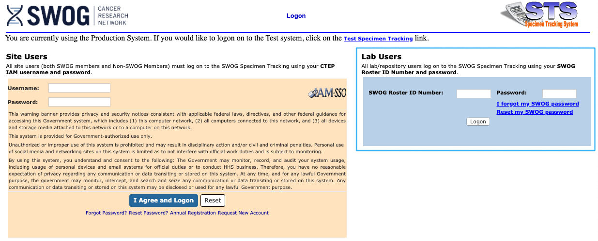
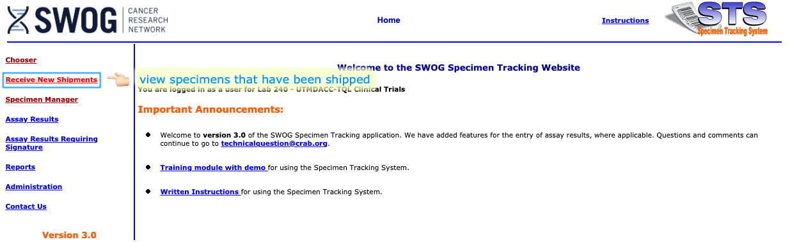
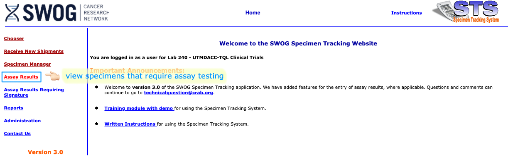
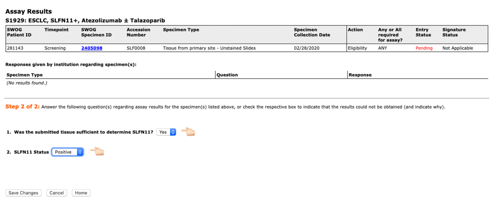
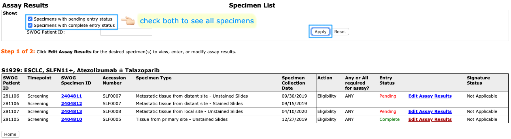

```{r xaringan-themer, include=FALSE, warning=FALSE}
library(xaringanthemer)
style_mono_accent(
  base_color = "#112345",
  header_font_google = google_font("Josefin Sans"),
  text_font_google   = google_font("Roboto", "300", "300i"),
  code_font_google   = google_font("Fira Mono")
)
```

class: center, middle 
# Outline

## Access SpecTrack
## Recieve New Shipment
## Enter Assay Results

---

## Access SpecTrack
- Access the SWOG [**Specimen Tracking System**](https://crawb.crab.org/SpecTrack/Logon.aspx) using _Internet Explorer_

- Log on with your SWOG Roster ID and password
.center[]

---

## Recieve New Shipment
- View shipments
.center[]

- Edit a shipment
.center[]

---

## Recieve New Shipment (continued)
- Enter **Condition on Arrival** → **Accession Number** → **Date Received**
- Leave a Comment, if necessary

.center[]

---

## Enter Assay Results
- View specimens that require assay testing
.center[]
- Edit the assay result of a specimen
.center[]

---

## Enter Assay Results (continued)

- Log **tissue sufficiency** and **assay result**
.center[]
- Return to Assay Specimen List to see _**Entry Status**_ of all specimens
.center[]
---

## Question?

- For SWOG STS-related questions, contact <technicalquestion@crab.org>

- For study-related questions, contact <S1929@swog.org>

- For questions regarding this instruction, contact <lqian@fredhutch.org>
