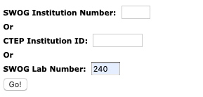
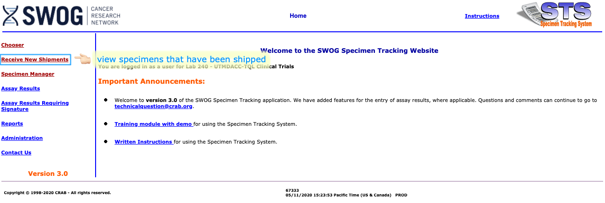
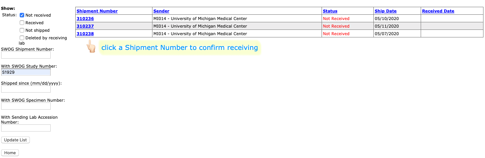
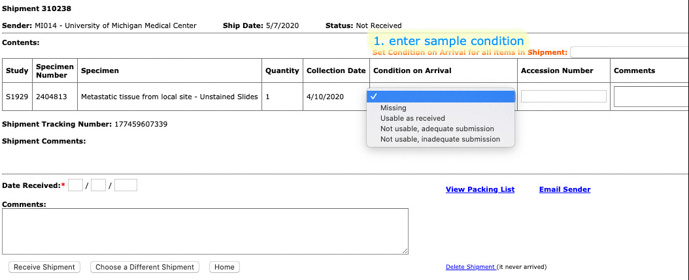
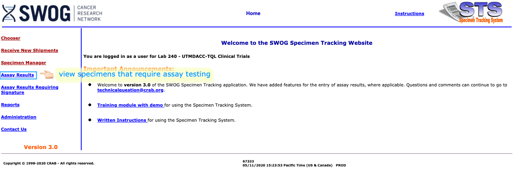
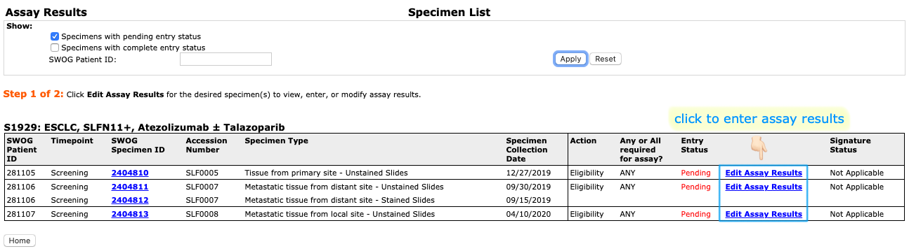

```{r xaringan-themer, include=FALSE, warning=FALSE}
library(xaringanthemer)
style_mono_accent(
  base_color = "#112345",
  header_font_google = google_font("Josefin Sans"),
  text_font_google   = google_font("Roboto", "300", "300i"),
  code_font_google   = google_font("Fira Mono")
)
```

class: center, middle 
# Outline

## Access SpecTrack
## Recieve New Shipment
## Enter Assay Results

---

## Access SpecTrack
- Access the SWOG [Specimen Tracking System](https://crawb.crab.org/SpecTrack/Logon.aspx) using **Internet Explorer**

- Log on with your CTEP IAM credentials or SWOG Roster ID
.center[]
- Enter SWOG Lab Number: **240**
.pull-right[]

---

## Recieve New Shipment
- View shipments
.center[]

- Edit a shipment
.center[]

---

## Recieve New Shipment (continued)

.center[]

---

## Enter Assay Results
- View specimens that require assay testing
.center[]
- Edit the assay result of a specimen
.center[]

---

## Enter Assay Results (continued)

- Log tissue sufficiency and assay result

- Return to Assay Specimen List to see **Entry Status** of all specimens

---

## Question?

- For SWOG STS-related questions, contact <technicalquestion@crab.org>

- For study-related questions, contact <S1929@swog.org>

- For questions regarding this instruction, contact <lqian@fredhutch.org>
